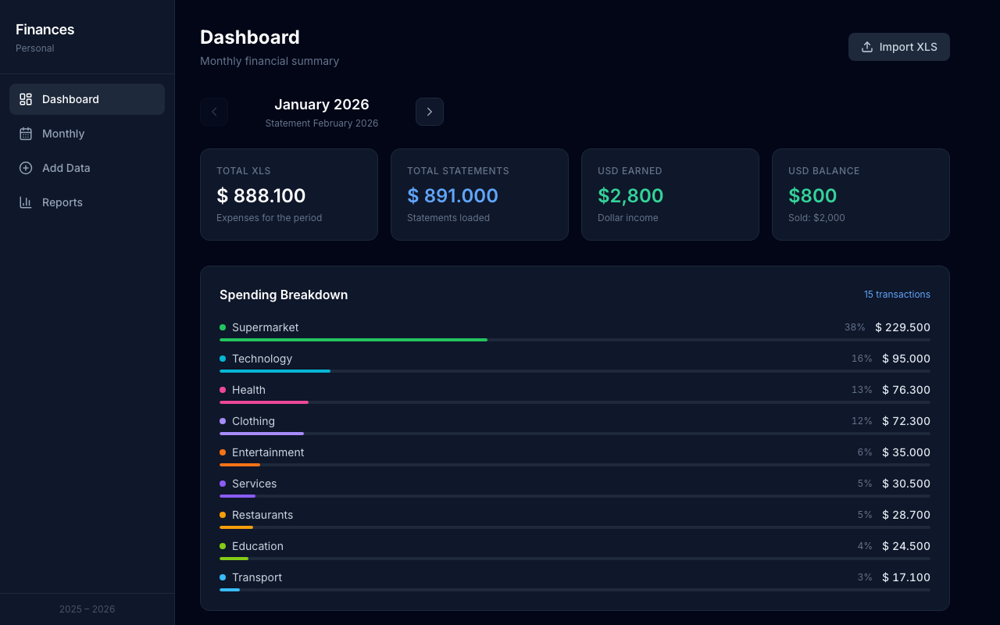
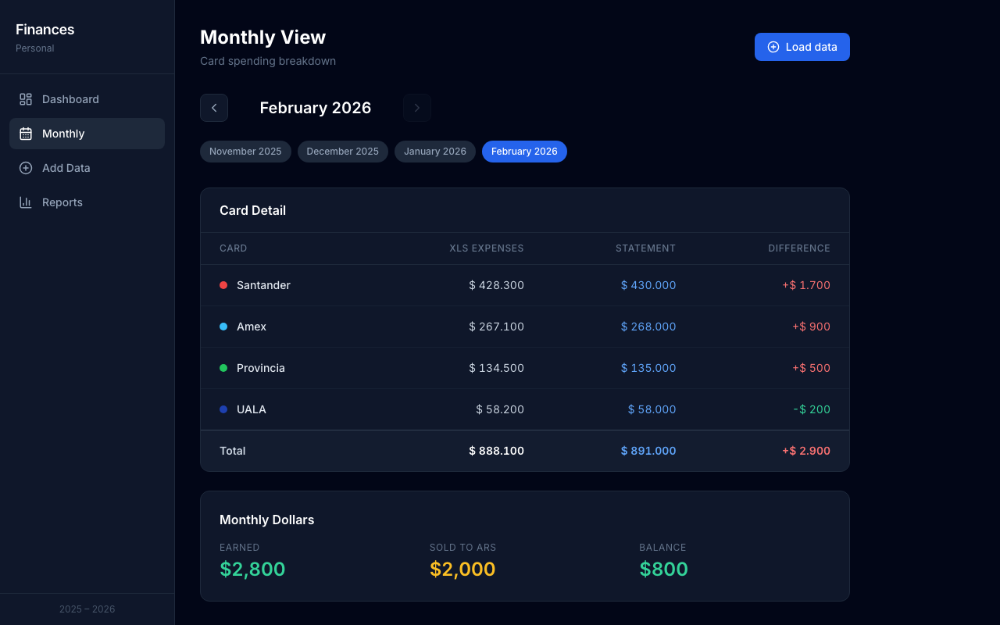
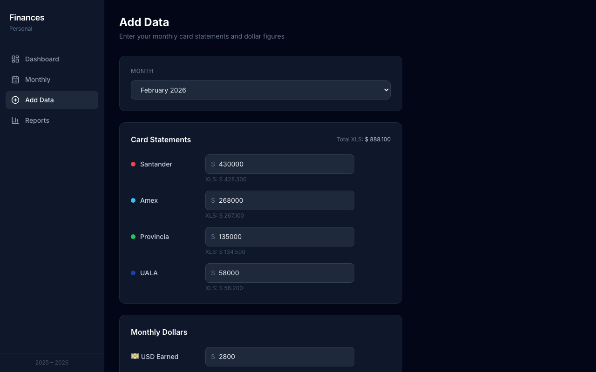
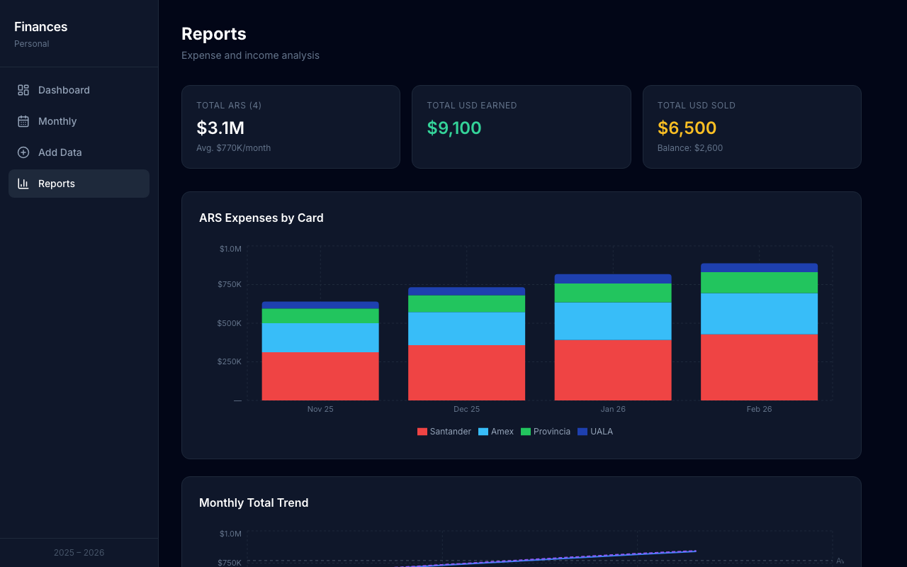

# PersonalFin

A personal finance tracker for managing and categorizing bank statement transactions across multiple cards and months. Built as a fully client-side app — no backend, no accounts, no data leaves your browser.

The app automatically detects your browser's language and renders in **English** or **Spanish** accordingly.

---

## Features

- **Multi-card statement tracking** — Log monthly totals for each credit/debit card
- **CSV / XLSX import** — Upload bank statements, map columns, and auto-categorize transactions
- **Multiple statements per month** — Append or replace statements from different cards
- **Auto-categorization** — Keyword-based engine assigns categories automatically (extensible to LLM)
- **Manual corrections** — Edit any transaction's category after import
- **Closing validation** — Visual check that categorized total matches the statement total
- **USD tracking** — Log USD earned and sold per month alongside ARS expenses
- **Monthly dashboard** — Spending breakdown by category with charts
- **Reports view** — Trends and summaries across months
- **Persistent storage** — All data lives in `localStorage`, zero server dependency

---

## Tech Stack

| Layer | Tech |
|---|---|
| UI | React 18 |
| Build | Vite |
| Styling | Tailwind CSS |
| State | Zustand (with localStorage persistence) |
| Charts | Recharts |
| File parsing | papaparse (CSV), xlsx (XLS/XLSX) |
| Icons | lucide-react |
| Routing | React Router v6 |

---

## Architecture

```
src/
├── components/       # UI components (Dashboard, EntryForm, TransactionList, etc.)
├── store/
│   └── useFinanceStore.js   # Global state with Zustand + localStorage
└── utils/
    ├── categorizer.js       # Keyword-based transaction categorization
    ├── statementParser.js   # CSV/XLSX parsing
    └── format.js            # Formatting helpers (ARS, dates, etc.)
```

**Key design decisions:**
- **No backend** — all processing and storage is client-side. Files are parsed in the browser using Web APIs.
- **Month-centric model** — data is organized by `YYYY-MM` keys; each month holds card totals, USD data, and transactions.
- **Pluggable categorizer** — `categorizer.js` exposes a simple interface (`categorizeTransactions(txs)`) designed to be swapped out for an LLM call (Claude, OpenAI) without changing the rest of the app.
- **Multi-statement support** — transactions can be appended across multiple uploads per month, or replaced entirely.

---

## Getting Started

```bash
# Install dependencies
npm install

# Start development server
npm run dev

# Build for production
npm run build
```

App runs at `http://localhost:5173` by default.

---

## Screenshots









---

## Built with AI

This project was developed with [Claude Code](https://claude.ai/code) by Anthropic. All features — architecture, components, i18n, categorization engine, and more — were implemented through AI-assisted pair programming.

---

## License

MIT
