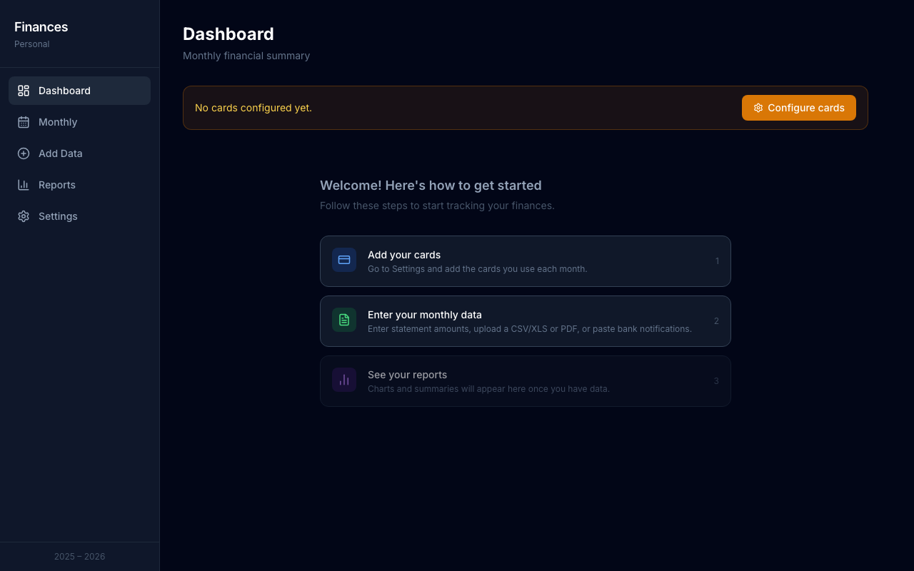
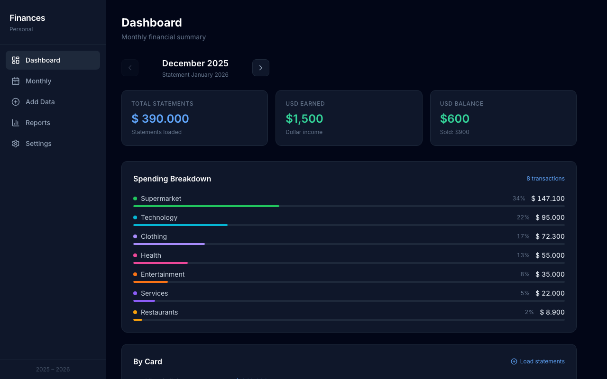
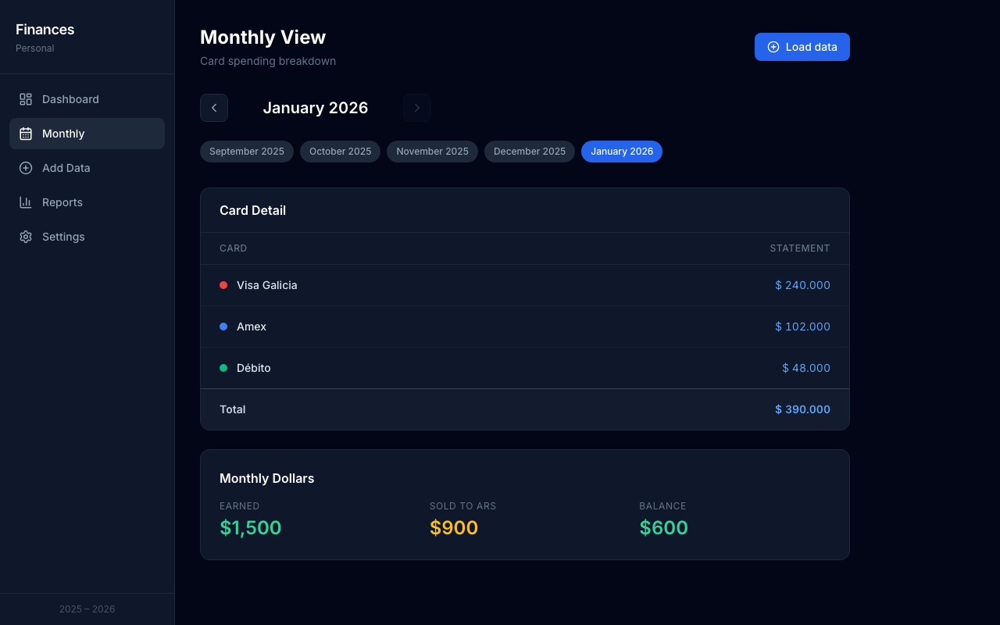
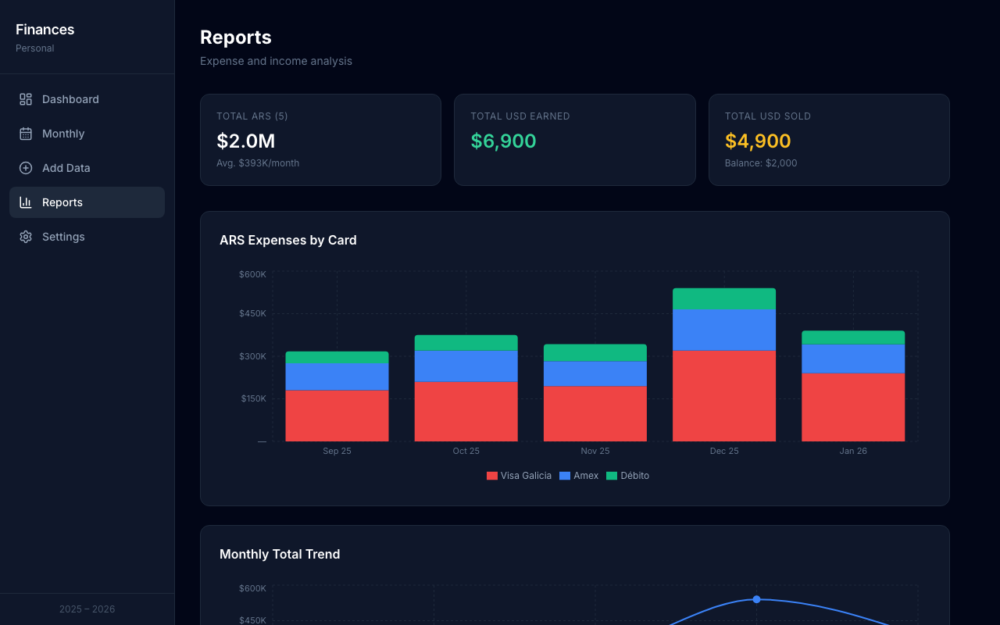
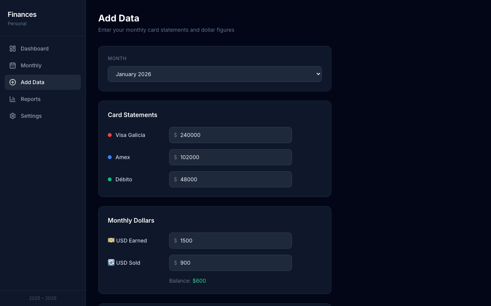
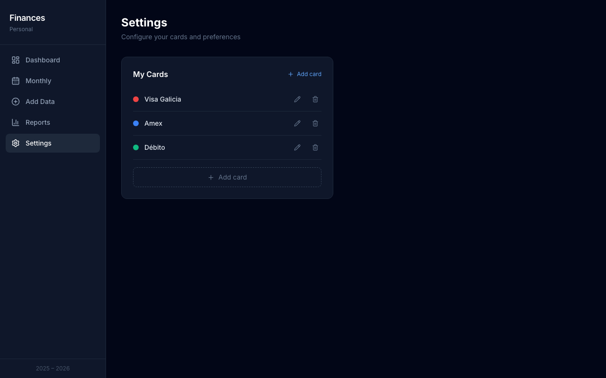

# PersonalFin

A personal finance tracker for managing monthly card statements, categorizing transactions, and tracking USD income — built entirely client-side. No backend, no accounts, no data leaves your browser.

Works with **any bank cards** you configure. Supports importing transactions from CSV/XLS files, PDF bank statements, or by pasting SMS/push notifications directly.

The app auto-detects your browser language and renders in **English** or **Spanish**.

---

## Screenshots

**Getting started — onboarding guide shown on first launch**


**Dashboard — monthly summary with stats, spending breakdown, and card totals**


**Monthly View — per-card statement detail with USD earned/sold section**


**Reports — stacked bar chart by card, monthly trend line, totals table**


**Add Data — enter statements, upload CSV/XLS or PDF, paste bank notifications**


**Settings — configure your cards with custom names and colors**


---

## Features

### Data entry
- **Configurable cards** — Add any credit/debit cards you use, with custom names and color labels
- **Manual statement entry** — Type in the total amount for each card per month
- **CSV / XLS import** — Upload a bank statement file, map columns interactively, and auto-categorize transactions
- **PDF statement import** — Drop a PDF from a supported bank — transactions are extracted automatically in the browser
- **SMS / push notification paste** — Paste one or more bank notifications and transactions are detected instantly
- **Multiple statements per month** — Append transactions from different cards or replace them entirely

### Categorization
- **Auto-categorization** — Keyword-based engine assigns categories on import (Supermarket, Restaurants, Transport, Services, Health, Entertainment, Clothing, Technology, Education, Other)
- **Manual corrections** — Edit any transaction's category after import
- **Closing validation** — Visual check that the sum of categorized transactions matches the declared statement total

### Tracking & reporting
- **USD tracking** — Log USD earned and sold each month alongside ARS expenses; balance is calculated automatically
- **Dashboard** — Spending breakdown by category with a donut chart; per-card statement summary; month navigator
- **Monthly View** — Per-card table with statement amounts; USD earned/sold/balance section
- **Reports** — Stacked bar chart (ARS by card over time), monthly trend line, USD earned vs. sold bar chart, summary table

### Privacy & storage
- **Fully private** — All processing (file parsing, PDF extraction, categorization) happens in the browser; nothing is sent to any server
- **localStorage persistence** — Data survives page refreshes with no sign-up required
- **No dependencies on external services** — works completely offline after the initial page load

---

## Supported banks (PDF + SMS parsing)

| Bank | PDF import | SMS / push import |
|------|:---:|:---:|
| Santander | ✓ | ✓ |
| BBVA | ✓ | ✓ |
| Banco Galicia | ✓ | ✓ |
| Mercado Pago | ✓ | ✓ |
| Naranja X | ✓ | ✓ |
| Uala | — | ✓ |
| Banco Provincia | — | ✓ |

Any bank not listed can still be used via CSV/XLS upload with the column mapper.

---

## Tech Stack

| Layer | Tech |
|---|---|
| UI | React 18 |
| Build | Vite |
| Styling | Tailwind CSS |
| State | Zustand + localStorage persistence |
| Charts | Recharts |
| Routing | React Router v6 |
| Icons | lucide-react |
| CSV / XLS parsing | papaparse, xlsx |
| PDF parsing | pdfjs-dist (lazy-loaded, ~3 MB) |
| i18n | Custom hook — English + Spanish |

---

## Architecture

```
src/
├── components/
│   ├── Dashboard.jsx        # Monthly summary, category chart, card breakdown
│   ├── MonthlyView.jsx      # Per-card table, USD section
│   ├── EntryForm.jsx        # Statement entry, upload triggers
│   ├── TransactionList.jsx  # Review, edit categories, save breakdown
│   ├── ColumnMapper.jsx     # Interactive CSV column mapping
│   ├── PdfUpload.jsx        # Drag-drop PDF upload UI
│   └── SmsPaste.jsx         # SMS / push notification paste UI
├── pages/
│   ├── Reports.jsx          # Charts and summary table
│   └── Settings.jsx         # Card configuration (add / edit / delete)
├── store/
│   └── useFinanceStore.js   # Zustand store — config.cards + months
├── i18n/
│   ├── locales/en.js        # English strings
│   ├── locales/es.js        # Spanish strings
│   └── useTranslation.js    # Language detection hook
└── utils/
    ├── categorizer.js       # Keyword-based auto-categorization
    ├── statementParser.js   # CSV/XLS parsing + column normalization
    ├── pdfParser.js         # PDF text extraction + bank pattern matching
    ├── smsParser.js         # SMS/push notification pattern matching
    ├── parseHelpers.js      # Shared amount + date parsing (ARS format)
    └── format.js            # ARS/USD formatting, date display helpers
```

**Key design decisions:**

- **No backend** — all parsing and storage is client-side; files never leave the browser.
- **Configurable cards** — `config.cards` is a plain array of `{ id, name, color }` objects. No hardcoded bank names. Any number of cards.
- **Month-centric data model** — state is keyed by `YYYY-MM`; each month holds `statements` (per-card amounts), `usdEarned`, `usdSold`, and `transactions[]`.
- **Backwards-compatible migration** — existing localStorage data from older versions is automatically migrated on first load via `onRehydrateStorage`.
- **Lazy PDF loading** — `pdfjs-dist` is dynamically `import()`ed only when the user clicks "Upload PDF", keeping the initial JS bundle small.
- **Pluggable categorizer** — `categorizer.js` has a single entry point (`categorizeTransactions(txs)`) designed to be swapped for an LLM call (Claude, OpenAI, etc.) without touching any other file.
- **Multi-statement support** — transactions can be appended or fully replaced per month, enabling multiple card imports in one session.

---

## Getting Started

```bash
# Install dependencies
npm install

# Start development server
npm run dev

# Build for production
npm run build
```

App runs at `http://localhost:5173` by default.

On first launch, the onboarding guide walks you through:
1. **Settings** → add your cards (name + color)
2. **Add Data** → enter statement amounts or upload a file
3. **Dashboard / Reports** → view your spending

---

## Built with AI

This project was built with [Claude Code](https://claude.ai/code) by Anthropic. Architecture, components, parsers, i18n, and the categorization engine were all implemented through AI-assisted pair programming.

---

## License

MIT
